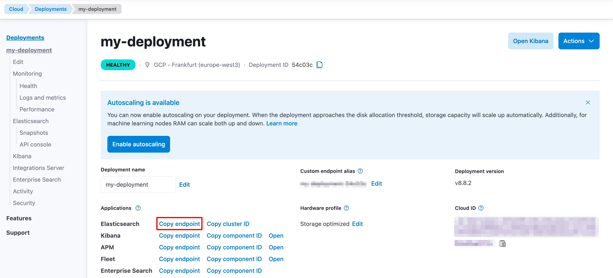

# WS-indexer

The project demostrate how to have a WebServices that expose a service and you want to ingest the result of each invocation into Elastic.
To achieve that the project uses [`http_poller`](https://www.elastic.co/guide/en/logstash/current/plugins-inputs-http_poller.html) input plugin from logstash  


## Requirements
- Elastic Cluster
- Logstash

### Elastic Cluster
- **Local**, you can run elastic on [docker](https://www.elastic.co/guide/en/elasticsearch/reference/current/docker.html)   
  The Elasticsearch endpoit will be https://localhost:9200
- **Cloud**, you can start a free trial on [Elastic Cloud](https://cloud.elastic.co/)    
  In Elastic Cloud the Elasticsearch endpoint can be found on the **My deployment** page of your deployment:
  

### Logstash
When you have the `endpoint url` you need to put this properties in file [pipeline.conf](pipeline.conf) in the latest section `output` based on the Elastic deployment you chose
- **local**
```shell script
output {
  elasticsearch {
    hosts => ["http://localhost:9200"]
    user => "elastic"
    password => "<PASSWORD>"    
    index => "wsindex"
  }
}
```
- **cloud**
```shell script
output {
  elasticsearch{
    cloud_id => "<CLOUD_ID>"
    cloud_auth => "elastic:<PASSWORD>"
    index => "wsindex"
  }
}
```

## Create Elastic Index
Open the `Dev Tools` and put the input took from [index.es](index.es)

## Running the application
The application can be started using:
```shell script
./mvnw spring-boot:run
```

## Running logstash
Use the command line to start Logstash with your configuration file. Navigate to the directory where Logstash is installed and run:
```shell script
bin/logstash -f path/to/pipeline.conf
```
Replace path/to/pipeline.conf with the actual path to your configuration file.

## Verify Indexed Documents
You can verify the documents on the Management page under `Dev Tools`.
```shell script
GET wsindex/_search
```


## Related Guides
- Logstash ([guide](https://www.elastic.co/guide/en/logstash/current/index.html))
